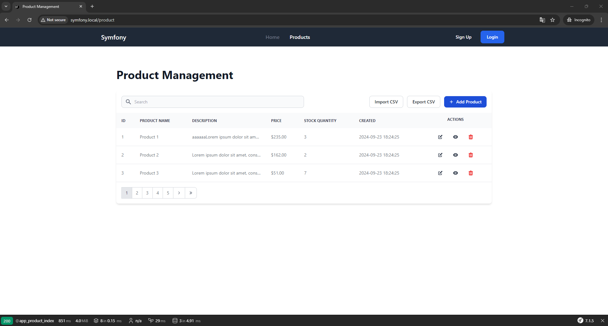

# Symfony Product CRUD

This web application is designed to manage products using a basic CRUD (Create, Read, Update, Delete) interface. This project is built using **[Symfony 7](https://symfony.com/7)** framework, utilizes **Docker** for containerization, and uses **Twig** for templating with **Tailwind CSS** for styling.

## Technologies Used

- **Symfony 7**: A modern PHP framework providing a robust foundation for web applications.
- **Docker**: A platform for building, shipping, and running applications in containers.
- **Twig**: A flexible templating engine for Symfony.
- **Tailwind CSS**: A utility-first CSS framework for rapid UI development.

## Prerequisites

- **Docker Desktop**: Ensure you have [Docker Desktop](https://www.docker.com/products/docker-desktop/) installed in your system.

## Getting Started

### Clone the Repository
```
git clone https://github.com/by-katorin/symfony-dockerized.git
```

### Make Initial Setup
```
cp .env.example .env
```
Make sure to input necessary values to the following environment variable
```
DATABASE_URL=mysql://symfony:secret@db:3306/symfony?serverVersion=8.3.0
```
> Note: `db:3360` is the service name (and port) defined in the .docker/docker-compose.yml file for database MySQL container, while `symfony` is the MySQL user with the password `secret`. The last `symfony` is the MySQL database name.

Go to `.docker/` directory
```
cd .docker
cp .env.example .env
cp .env.nginx .env.nginx.local
```
Add value to `NGINX_BACKEND_DOMAIN` variable in the copied file
```
NGINX_BACKEND_DOMAIN='symfony.local' # anything you prefer
```
Modify your OS `hosts` file accordingly
```
127.0.0.1   symfony.local
```

### Build Docker Containers
```
cd .docker
docker compose build
docker compose up -d
```

### Install Dependencies

Inside `php` container, install dependencies using Composer
```
docker compose exec php bash
```
```
composer install
```

### Run Database Migrations
```
docker compose exec php bash
```
```
php bin/console make:migration
php bin/console doctrine:migrations:migrate
```

## Usage

### Build Tailwind CSS
```
php bin/console tailwind:build
```


### Access the Application

Visit http://symfony.local/product or http://localhost/product in your web browser.


## Contributing

Contributions are welcome! Please follow these guidelines:

- Fork the Repository: Fork the project on GitHub.
- Create a Branch: Create a new branch for your feature or bug fix.
- Make Changes: Implement your changes and write tests.
- Submit a Pull Request: Submit a pull request to the main branch.

## Additional Notes

- For more information on Symfony, Tailwind CSS, and Docker, please refer to their official documentation.
- Customize the project to fit your specific needs by adding more features or modifying the existing ones.
